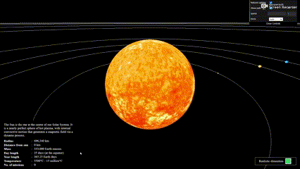

# 🌌 Realistic 3D Solar System Simulation

Welcome to the **Realistic 3D Solar System** project — a fully interactive and educational simulation of our solar system. This version is a significant upgrade from the earlier project *solar-system3D*, with enhanced accuracy, improved visuals, and a host of new features.

Explore the solar system in both scientifically accurate and simplified modes, learn about each celestial body, and experience an immersive 3D journey through space.

<!-- [🌍 Live Demo](https://your-username.github.io/realistic-3d-solar-system) -->

---

## ✨ Key Features

- **Accurate Visualization**: Realistic scaling of planets, orbits, and rotations based on actual astronomical data.
- **Interactive Exploration**: Click on planets or the sun to access detailed information.
- **Dynamic Camera**: Smooth camera transitions that follow your selected celestial body.
- **Informative Details**: Learn about the size, composition, orbit, and fun facts for each planet and star.
- **Simulation Controls**: Adjust simulation speed, toggle between realistic/simplified modes, or pause the scene.
- **Orbit Rendering**: Visual display of planetary orbits with toggleable visibility.
- **Day/Night Effect**: Simulated lighting for planets with atmospheres.
- **Customizable UI**: Modify simulation settings using an intuitive interface.
- **Responsive Layout**: Optimized for both desktop and mobile viewing.

---

## 🛠️ Technologies Used

- **[Three.js](https://threejs.org/)**: The primary engine powering the 3D graphics and animations, enabling lifelike rendering of the solar system.
- **JavaScript**: Drives the interactivity, logic, and animations within the simulation.
- **HTML5**: Provides the structural framework for embedding the 3D canvas on the web page.
- **CSS3**: Enhances the visual styling and responsiveness of the simulation layout.
- **[dat.GUI](https://github.com/dataarts/dat.gui)**: Offers an easy-to-use graphical interface for users to modify simulation parameters in real-time.

---

## 🚀 Future Enhancements *(Optional)*

- Add moons and other celestial bodies (asteroids, dwarf planets)
- Implement real-time planetary positioning
- Introduce voice-guided tours or AR support

---

Feel free to fork, contribute, or customize this project for your own use. Happy stargazing! 🌠
